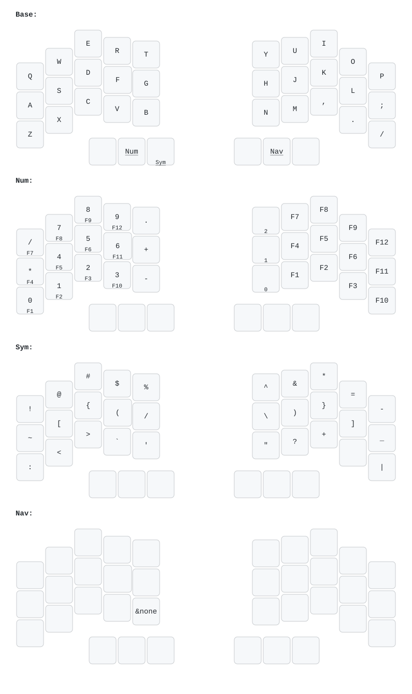

# Crosses 36 ZMK Firmware

ZMK firmware configuration for the **Crosses 36** split keyboard: two nice!nano v2 halves, a Seeed XIAO BLE dongle with a dongle screen, and PMW3610 trackballs on both halves.

### Default Firmware Keymap


## Branches

- **`main`** — base keyboard config using upstream ZMK. Has the dongle target but historically included ZMK Studio.
- **`dev/dongle`** — current working branch. Stripped ZMK Studio; uses `machetie/zmk-dongle-screen` for the dongle display and upstream ZMK modules.

> Do **not** use `dev/dongle-reimplementation`. It was deleted because it set `BT_MAX_CONN=2` / `BT_MAX_PAIRED=2` on the central, which broke split peripheral pairing.

## Hardware targets

| Role | Board | Shield | UF2 artifact |
|------|-------|--------|--------------|
| Left half | `nice_nano@2//zmk` | `crosses_left` | `crosses_left_nice_nano_2__zmk.uf2` |
| Right half | `nice_nano@2//zmk` | `crosses_right` | `crosses_right_nice_nano_2__zmk.uf2` |
| Dongle | `xiao_ble//zmk` | `crosses_dongle dongle_screen` | `crosses_dongle_dongle_screen_xiao_ble__zmk.uf2` |
| Settings reset (halves) | `nice_nano@2//zmk` | `settings_reset` | `settings_reset_nice_nano_2__zmk.uf2` |
| Settings reset (dongle) | `xiao_ble//zmk` | `settings_reset` | `settings_reset_xiao_ble__zmk.uf2` |

## Quick start

1. Make sure the ZMK workspace venv is available at `~/Documents/git/zmk-workspace-venv`.
2. Run `west update` to pull the correct upstream ZMK and module revisions.
3. Build a target:

   ```bash
   ./zmk-build.sh crosses_left
   ./zmk-build.sh crosses_right
   ./zmk-build.sh "crosses_dongle dongle_screen" xiao_ble//zmk
   ./zmk-build.sh settings_reset nice_nano@2//zmk
   ./zmk-build.sh settings_reset xiao_ble//zmk
   ```

4. Collect outputs:

   ```bash
   ./zmk-build.sh --collect
   ```

   Collected `.uf2` files appear in `firmware/`.

## Flashing after a bad pairing state

1. Flash the correct `settings_reset` target to each device.
2. Flash `crosses_left`, `crosses_right`, and the dongle firmware.
3. Power-cycle the dongle, then the halves. Pairing is automatic for ZMK split.

## Important notes

- This repo is a ZMK **config module**; the actual ZMK source, Zephyr, and external modules are pulled by `west` into gitignored directories (`zmk/`, `zephyr/`, `modules/`, `optional/`, `zmk-dongle-screen/`, etc.).
- Always run `west update` after switching branches that change `config/west.yml`.
- The local `zmk-build.sh` script stages a clean copy of the git-tracked files as `ZMK_EXTRA_MODULES` so the committed `zephyr/module.yml` (which declares `board_root: .`) stays intact despite `west update` overwriting `./zephyr/`.
